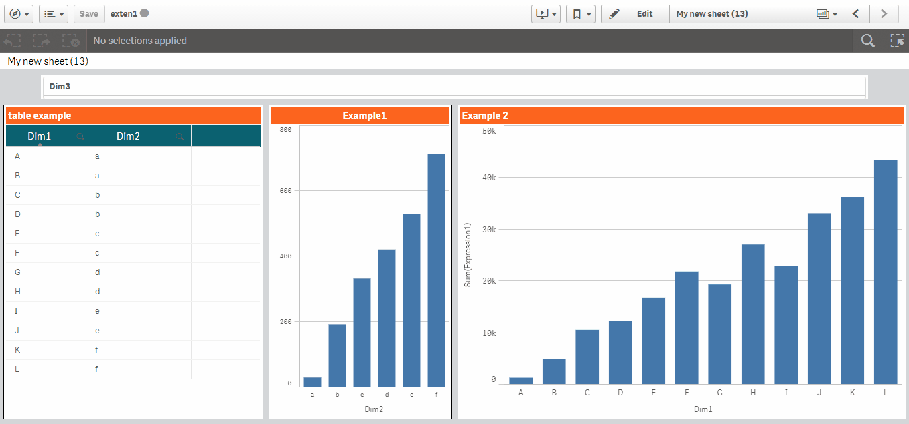

# QlikSense-Sheet-Styler  
Style Qlik Sense sheets and objects with some option which can change the look and feel of your Sheet
 
<b>First Version:</b>
Options: 
1.    Option to add background color or image 
2.    Background transparency 
3.    Can change Sheet title height, text color and font size 
4.    Can change an objects header text color, text alignment, background color 
5.    Can change hover color, text alignment, background color of table header

<b>Second Version:</b>
Improvements and functions added:
1.    Table Alternate Row color (by - Tolberta14)
2.    Screen Resizer I suggest use 24 x 48 (by - anders.uddenberg)
3.    Hide Header
4.    can adjust container border
5.    fixed filter border (by - AdamD)

<h3>New Version</h3>
 

<h3>Old Version</h3>
 

This is the second version, third version is on its way mostly by end of this month
 
I will Add More options if possible
 
Leave Comments for any Improvements in this styling extension
